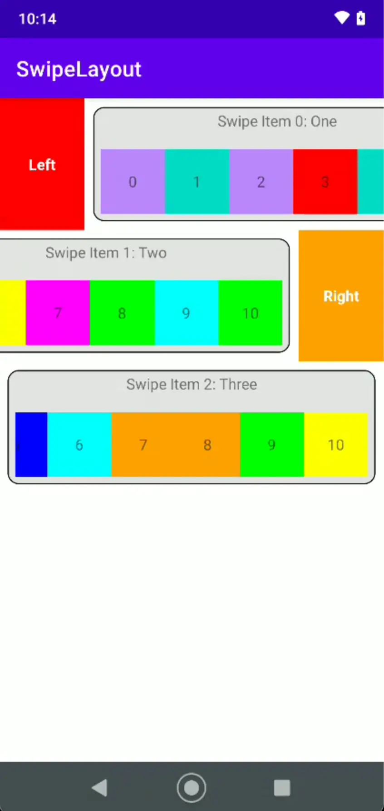

# Swipe Layout Sample - Android
This app shows a sample of how to use the swipe-layout library in an Android App.
Also, includes in every swipe item a horizontal scroll view with items that can be scrolled.

## Instructions
1. Clone this repository
2. Build it with Android Studio
3. Install it in an Android device and use it

## License
MIT

## About the author
*[Jhonyfer's blog](https://viejony.github.io/blog/en)*
